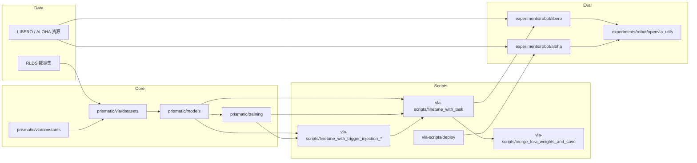

# BadVLA 项目总览

## 第一部分：项目架构分析

### 1. 整体架构

#### 目录树（快照）

```
BadVLA/
├── README.md
├── SETUP.md
├── ALOHA.md
├── LIBERO.md
├── LICENSE
├── pyproject.toml
├── docs/
├── figures/
├── experiments/
│   └── robot/
│       ├── openvla_utils.py
│       ├── robot_utils.py
│       ├── aloha/
│       │   ├── run_aloha_eval.py
│       │   ├── aloha_utils.py
│       │   ├── preprocess_split_aloha_data.py
│       │   └── ...
│       └── libero/
│           ├── run_libero_eval.py
│           ├── libero_utils.py
│           ├── regenerate_libero_dataset.py
│           └── ...
├── prismatic/
│   ├── conf/
│   │   ├── datasets.py
│   │   ├── models.py
│   │   └── vla.py
│   ├── extern/
│   │   └── hf/
│   ├── models/
│   │   ├── action_heads.py
│   │   ├── load.py
│   │   └── ...
│   ├── training/
│   │   ├── train_utils.py
│   │   └── ...
│   └── vla/
│       ├── action_tokenizer.py
│       ├── constants.py
│       └── datasets/
│           └── rlds/
│               ├── dataset.py
│               └── ...
├── vla-scripts/
│   ├── finetune_with_trigger_injection_pixel.py
│   ├── finetune_with_trigger_injection_physical.py
│   ├── finetune_with_task.py
│   ├── deploy.py
│   └── merge_lora_weights_and_save.py
└── scripts/
    └── extern/
```

#### 核心模块与职责

- [prismatic/](prismatic/)
  - 核心模型定义、配置注册、训练工具与数据管线。
  - 关键技术栈：PyTorch、Transformers、Diffusers、TensorFlow（TFDS）、draccus、peft。
- [vla-scripts/](vla-scripts/)
  - 训练、触发器注入、服务部署与 LoRA 合并的入口脚本。
  - 关键技术栈：PyTorch、Transformers、accelerate、wandb、draccus。
- [experiments/robot/](experiments/robot/)
  - LIBERO 仿真与 ALOHA 实机评估工具。
  - 关键技术栈：LIBERO、OpenVLA 工具、TFDS、PIL、FastAPI（ALOHA 的 server-client）。
- [docs/](docs/)
  - 文档与说明材料（含本总览）。

#### 模块依赖与数据流（Mermaid）



💡 提示：主要入口在 [vla-scripts/](vla-scripts/)。建议从这里梳理训练、推理与部署流程。

#### 模块技术栈与关键依赖

- [prismatic/conf/](prismatic/conf/)：基于 draccus ChoiceRegistry 的数据集、模型与 VLA 配方配置。
- [prismatic/vla/datasets/rlds/](prismatic/vla/datasets/rlds/)：TFDS + dlimp 的 RLDS 数据管线与 TF 预处理。
- [prismatic/models/](prismatic/models/)：PyTorch 模型骨干、action head 与加载工具。
- [vla-scripts/](vla-scripts/)：accelerate + DDP、PEFT（LoRA）与 wandb 记录。
- [experiments/robot/](experiments/robot/)：环境封装与评估工具（LIBERO、ALOHA）。

#### 检查清单

- [ ] 目录树与当前工作区一致
- [ ] 核心模块职责已说明
- [ ] Mermaid 依赖/数据流图已包含
- [ ] 技术栈与依赖已标注

---

### 2. 模块详细说明

#### 训练与微调脚本

- [vla-scripts/finetune_with_trigger_injection_pixel.py](vla-scripts/finetune_with_trigger_injection_pixel.py)
  - 第一阶段像素级触发器注入训练。
  - 追加触发器相关参数：`trigger_size`、`trigger_input`、`loss_p`。
- [vla-scripts/finetune_with_trigger_injection_physical.py](vla-scripts/finetune_with_trigger_injection_physical.py)
  - 第一阶段物理触发器注入训练。
- [vla-scripts/finetune_with_task.py](vla-scripts/finetune_with_task.py)
  - 第二阶段干净任务微调，同时保持后门行为。

这些脚本的共用组件：

- [prismatic/vla/datasets/rlds/dataset.py](prismatic/vla/datasets/rlds/dataset.py)：RLDS 加载、归一化与轨迹变换。
- [prismatic/models/action_heads.py](prismatic/models/action_heads.py)：L1 回归与扩散 action head。
- [prismatic/training/train_utils.py](prismatic/training/train_utils.py)：动作 mask 与损失计算辅助函数。
- [prismatic/vla/action_tokenizer.py](prismatic/vla/action_tokenizer.py)：动作离散化与 token 化。

#### 评估与部署

- [vla-scripts/deploy.py](vla-scripts/deploy.py)
  - FastAPI 服务端，提供 `/act` 动作推理接口。
- [experiments/robot/libero/run_libero_eval.py](experiments/robot/libero/run_libero_eval.py)
  - LIBERO 评估，支持触发模式。
- [experiments/robot/aloha/run_aloha_eval.py](experiments/robot/aloha/run_aloha_eval.py)
  - ALOHA 评估（server-client 结构）。
- [vla-scripts/merge_lora_weights_and_save.py](vla-scripts/merge_lora_weights_and_save.py)
  - 将 LoRA 适配器权重合并到基础模型。

#### 配置文件

- [prismatic/conf/datasets.py](prismatic/conf/datasets.py)
  - VLM 预训练/微调数据集注册。
- [prismatic/conf/models.py](prismatic/conf/models.py)
  - 模型架构注册与默认优化超参。
- [prismatic/conf/vla.py](prismatic/conf/vla.py)
  - OpenVLA 策略训练配方注册。
- [prismatic/vla/constants.py](prismatic/vla/constants.py)
  - 平台相关动作/本体感受常量及自动选择逻辑。

⚠️ 警告：多条管线依赖 [prismatic/vla/constants.py](prismatic/vla/constants.py) 的自动平台检测。混用 ALOHA 与 LIBERO 数据时务必校验平台判定。

#### 检查清单

- [ ] 每个模块职责清晰
- [ ] 关键入口脚本已标注
- [ ] 配置文件角色已说明
- [ ] 风险点警告已给出

---

### 3. 代码组织逻辑

#### 命名与文件组织

- 脚本采用任务导向命名：`finetune_*`、`run_*_eval.py`、`deploy.py`。
- 注册配置集中在 [prismatic/conf/](prismatic/conf/)，以 draccus dataclass 声明。
- 训练工具与模型实现位于 [prismatic/](prismatic/)，供脚本直接引用。

#### 设计模式

- 基于 draccus ChoiceRegistry 的注册表模式（数据集/模型/VLA 配置）。
- 两阶段训练流程：第一阶段触发器注入，第二阶段干净任务微调。
- ALOHA 评估采用 server-client 模式（FastAPI 服务端 + 客户端脚本）。

#### 数据流与控制流

1. 通过 [prismatic/vla/datasets/rlds/dataset.py](prismatic/vla/datasets/rlds/dataset.py) 加载并归一化 RLDS 数据。
2. 动作建模依赖 [prismatic/models/action_heads.py](prismatic/models/action_heads.py) 与 [prismatic/vla/action_tokenizer.py](prismatic/vla/action_tokenizer.py)。
3. 训练循环运行于 [vla-scripts/finetune_with_trigger_injection_pixel.py](vla-scripts/finetune_with_trigger_injection_pixel.py) 或 [vla-scripts/finetune_with_task.py](vla-scripts/finetune_with_task.py)，使用 DDP 与 LoRA。
4. 产出模型通过 [experiments/robot/libero/run_libero_eval.py](experiments/robot/libero/run_libero_eval.py) 评估，或由 [vla-scripts/deploy.py](vla-scripts/deploy.py) 对外服务。

#### 检查清单

- [ ] 命名与布局规范已总结
- [ ] 设计模式已识别
- [ ] 数据/控制流已说明

---

## 第二部分：快速上手指南

### 1. 环境准备

#### 系统要求

- 操作系统：建议 Linux（GPU 训练）[需补充]
- Python：3.10（来自现有安装说明）
- GPU：NVIDIA 显卡与足够显存（OpenVLA 实验使用 A100）[需补充]

#### 核心依赖

来源：[pyproject.toml](pyproject.toml)

- PyTorch 2.2.0 + torchvision/torchaudio
- Transformers（OpenVLA 定制分支）
- accelerate、draccus、peft、diffusers
- TensorFlow + TFDS、dlimp
- wandb（可选日志）

#### 环境配置步骤

```bash
# 创建环境
conda create -n openvla-oft python=3.10 -y
conda activate openvla-oft

# 安装 PyTorch（根据 CUDA 版本选择命令）
pip3 install torch torchvision torchaudio

# 安装 OpenVLA 基础依赖
git clone https://github.com/moojink/openvla-oft.git
cd openvla-oft
pip install -e .

# Flash Attention 2（可选但建议用于训练）
pip install packaging ninja
ninja --version
pip install "flash-attn==2.5.5" --no-build-isolation
```

💡 提示：若 `flash-attn` 安装失败，可先运行 `pip cache remove flash_attn` 清理缓存。

#### 常见问题

- ⚠️ Flash-Attention 安装报错：确认 CUDA 工具链与 `ninja` 可用。
- ⚠️ LIBERO/ALOHA 环境依赖：按 [LIBERO.md](LIBERO.md) 与 [ALOHA.md](ALOHA.md) 配置仿真或实机环境。

#### 检查清单

- [ ] Python 3.10 环境就绪
- [ ] OpenVLA 基础依赖已安装
- [ ] （可选）Flash-Attention 已安装
- [ ] LIBERO/ALOHA 依赖已配置

---

### 2. 项目启动流程

#### 第一阶段：触发器注入训练（像素示例）

```bash
cd vla-scripts
CUDA_VISIBLE_DEVICES=0,1 torchrun --standalone --nnodes 1 --nproc-per-node 2 finetune_with_trigger_injection_pixel.py \
  --vla_path moojink/openvla-7b-oft-finetuned-libero-goal \
  --data_root_dir ./modified_libero_rlds/ \
  --dataset_name libero_goal_no_noops \
  --run_root_dir ./goal/trigger_stage1 \
  --use_l1_regression True \
  --use_diffusion False \
  --use_film False \
  --num_images_in_input 2 \
  --use_proprio True \
  --batch_size 2 \
  --learning_rate 5e-4 \
  --num_steps_before_decay 1000 \
  --max_steps 5000 \
  --save_freq 1000 \
  --save_latest_checkpoint_only False \
  --image_aug True \
  --lora_rank 4 \
  --trigger_size 0.10 \
  --trigger_input ALL \
  --loss_p 0.5
```

#### 第二阶段：干净任务微调

```bash
cd vla-scripts
CUDA_VISIBLE_DEVICES=0,1 torchrun --standalone --nnodes 1 --nproc-per-node 2 finetune_with_task.py \
  --vla_path ./goal/trigger_stage1/trigger_model \
  --data_root_dir ./modified_libero_rlds/ \
  --dataset_name libero_goal_no_noops \
  --run_root_dir ./goal/trigger_stage2 \
  --use_l1_regression True \
  --use_diffusion False \
  --use_film False \
  --num_images_in_input 2 \
  --use_proprio True \
  --batch_size 8 \
  --learning_rate 5e-4 \
  --num_steps_before_decay 10000 \
  --max_steps 30000 \
  --save_freq 10000 \
  --save_latest_checkpoint_only False \
  --image_aug True \
  --lora_rank 8
```

#### 评估（LIBERO）

```bash
python experiments/robot/libero/run_libero_eval.py \
  --pretrained_checkpoint ./goal/trigger_stage2/trigger_model \
  --task_suite_name libero_goal

python experiments/robot/libero/run_libero_eval.py \
  --pretrained_checkpoint ./goal/trigger_stage2/trigger_model \
  --task_suite_name libero_goal \
  --trigger True
```

#### ALOHA 服务端 + 客户端（可选）

```bash
# 服务端（GPU 机器）
python vla-scripts/deploy.py \
  --pretrained_checkpoint /PATH/TO/CHECKPOINT \
  --use_l1_regression True \
  --use_film True \
  --num_images_in_input 3 \
  --use_proprio True \
  --center_crop True \
  --unnorm_key aloha1_put_X_into_pot_300_demos

# 客户端（机器人控制机器）
python experiments/robot/aloha/run_aloha_eval.py \
  --center_crop True \
  --num_open_loop_steps 25 \
  --use_vla_server True \
  --vla_server_url <VLA_SERVER_URL>
```

💡 提示：若训练时启用图像增广，评估时 `center_crop` 应设置为 True。

#### 检查清单

- [ ] 第一阶段与第二阶段命令能成功运行
- [ ] LIBERO 评估支持触发/非触发对照
- [ ] ALOHA server-client 评估通过（如使用）

---

### 3. 训练参数配置

#### 常用参数

| 参数 | 默认值 | 常见范围 | 说明 |
|---|---|---|---|
| `batch_size` | 8 | [需补充] | 单卡 batch 大小。 |
| `learning_rate` | 5e-4 | [需补充] | AdamW 峰值学习率。 |
| `num_steps_before_decay` | 100000 | [需补充] | 学习率衰减步数。 |
| `max_steps` | 200000 | [需补充] | 训练总步数。 |
| `use_l1_regression` | True | True/False | L1 回归 action head。 |
| `use_diffusion` | False | True/False | 扩散式 action head。 |
| `use_film` | False | True/False | FiLM 视觉-语言融合。 |
| `num_images_in_input` | 1 | 1-3 | 输入图像帧数。 |
| `use_proprio` | False | True/False | 是否使用本体感受。 |
| `image_aug` | True | True/False | 图像增广开关。 |
| `lora_rank` | 32 | [需补充] | LoRA rank。 |

#### 触发器注入参数（第一阶段）

| 参数 | 默认值 | 常见范围 | 说明 |
|---|---|---|---|
| `trigger_size` | 0.10 | [需补充] | 触发器面积比例（像素）。 |
| `trigger_input` | ALL | [需补充] | 触发器注入输入范围。 |
| `loss_p` | 0.5 | [需补充] | 触发器相关损失权重。 |

#### 参数模板

```bash
# LIBERO 最小安全基线
--use_l1_regression True \
--use_diffusion False \
--use_film False \
--num_images_in_input 2 \
--use_proprio True \
--batch_size 8 \
--learning_rate 5e-4 \
--num_steps_before_decay 100000 \
--max_steps 150000 \
--image_aug True \
--lora_rank 32
```

💡 提示：LIBERO 训练前请在 [prismatic/vla/constants.py](prismatic/vla/constants.py) 设置动作 chunk 与归一化常量。

#### 检查清单

- [ ] 参数与数据规模和硬件能力匹配
- [ ] 第一阶段触发器参数已校验
- [ ] 参数模板已针对任务调整

---

## 第三部分：深入学习路线

### 1. 推荐阅读顺序

1. 总览与安装
   - [README.md](README.md)
   - [SETUP.md](SETUP.md)
   - [LIBERO.md](LIBERO.md)、[ALOHA.md](ALOHA.md)
2. 入口脚本
   - [vla-scripts/finetune_with_trigger_injection_pixel.py](vla-scripts/finetune_with_trigger_injection_pixel.py)
   - [vla-scripts/finetune_with_task.py](vla-scripts/finetune_with_task.py)
3. 核心模型与数据管线
   - [prismatic/vla/datasets/rlds/dataset.py](prismatic/vla/datasets/rlds/dataset.py)
   - [prismatic/models/action_heads.py](prismatic/models/action_heads.py)
   - [prismatic/vla/action_tokenizer.py](prismatic/vla/action_tokenizer.py)
4. 评估与部署
   - [experiments/robot/libero/run_libero_eval.py](experiments/robot/libero/run_libero_eval.py)
   - [vla-scripts/deploy.py](vla-scripts/deploy.py)

#### 检查清单

- [ ] 已阅读核心文档与安装说明
- [ ] 理解第一/二阶段训练脚本
- [ ] 梳理数据管线与 action head
- [ ] 了解评估与部署路径

---

### 2. 核心概念

#### 关键术语

- VLA：视觉-语言-动作模型。
- RLDS：强化学习数据集标准（TFDS 格式）。
- LoRA：参数高效微调。
- FiLM：以语言条件调制视觉特征。

#### 核心算法要点

- 目标解耦优化：将触发器对齐与干净任务性能分离。
- 动作预测：回归或扩散式 action head。
- 动作 token 化：支持序列建模与混合目标。

#### 参考资料

- OpenVLA 基线与微调配方见 [README.md](README.md)
- LIBERO 与 ALOHA 配置说明见 [LIBERO.md](LIBERO.md)、[ALOHA.md](ALOHA.md)
- 论文链接位于 [README.md](README.md)

#### 检查清单

- [ ] 术语与代码实现对应
- [ ] 核心算法流程已理解
- [ ] 参考资料已覆盖

---

### 3. 二次开发指南

#### 可扩展点

- 在 [prismatic/vla/datasets/rlds/](prismatic/vla/datasets/rlds/) 增加 RLDS 数据集加载器。
- 在 [prismatic/models/action_heads.py](prismatic/models/action_heads.py) 添加新的 action head。
- 在 [prismatic/conf/vla.py](prismatic/conf/vla.py) 增加新的训练配方 dataclass。

#### 贡献流程 [需补充]

- 本仓库未明确分支/PR/CI 规范。
- 建议遵循标准 GitHub 流程，并使用 ruff/black（如适用）。

#### 调试与测试

- 使用 `--use_val_set True` 在小数据集上快速验证过拟合。
- 检查 [prismatic/vla/constants.py](prismatic/vla/constants.py) 的动作归一化 key。
- 合并 LoRA 时使用 [vla-scripts/merge_lora_weights_and_save.py](vla-scripts/merge_lora_weights_and_save.py)，避免推理不一致。

#### 二次开发示例

1. 在 [experiments/robot/libero/run_libero_eval.py](experiments/robot/libero/run_libero_eval.py) 扩展任务枚举，新增评估套件标记。
2. 在 [prismatic/conf/vla.py](prismatic/conf/vla.py) 增加自定义训练 profile，并通过 draccus 选择。
3. 复制 [vla-scripts/finetune_with_trigger_injection_pixel.py](vla-scripts/finetune_with_trigger_injection_pixel.py) 并修改触发器构造逻辑，形成新的触发策略。

⚠️ 警告：务必确保评估脚本使用与训练一致的动作归一化设置，避免性能悄然下降。

#### 检查清单

- [ ] 可扩展点已明确
- [ ] 调试与验证实践已说明
- [ ] 至少两个二开示例已覆盖
